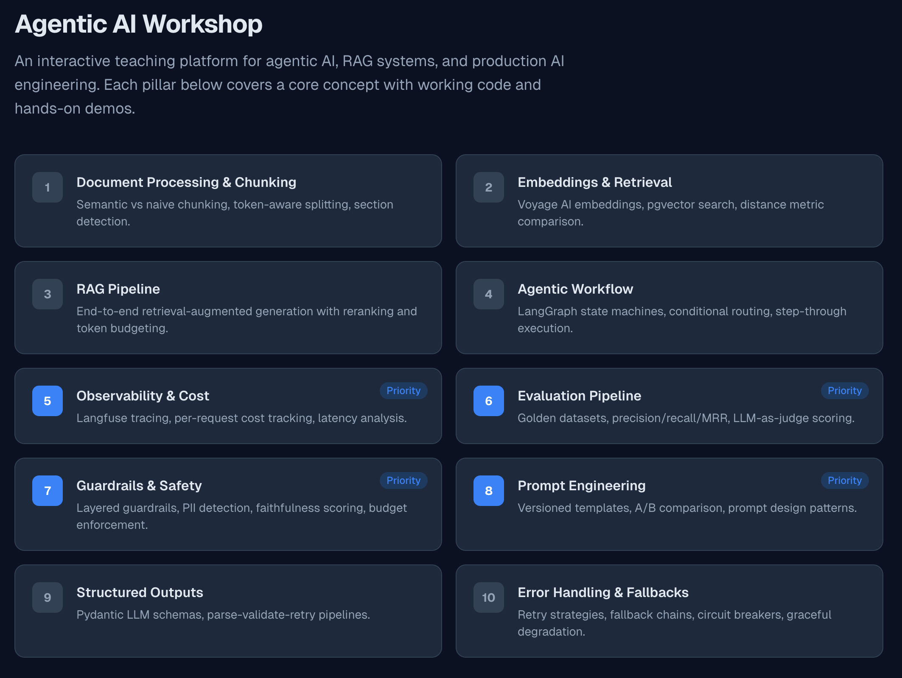
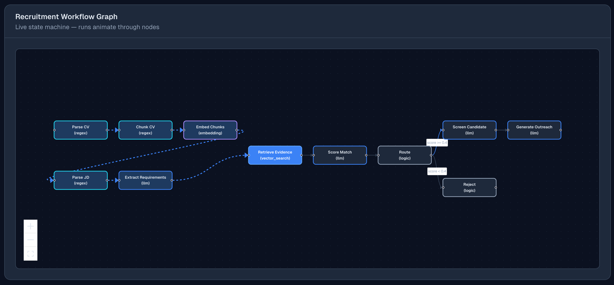
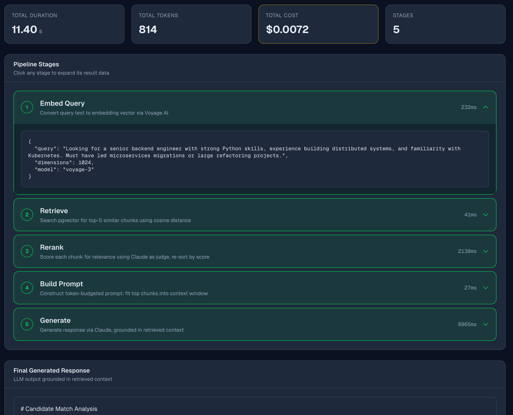
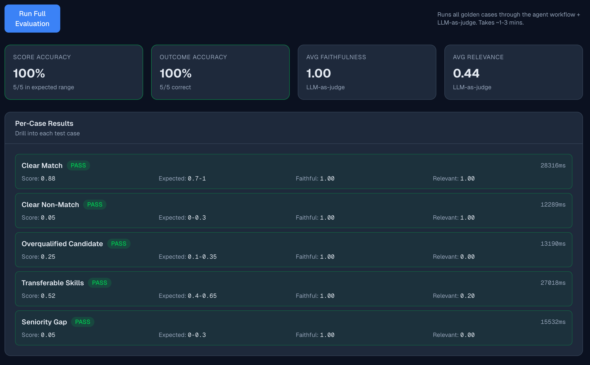
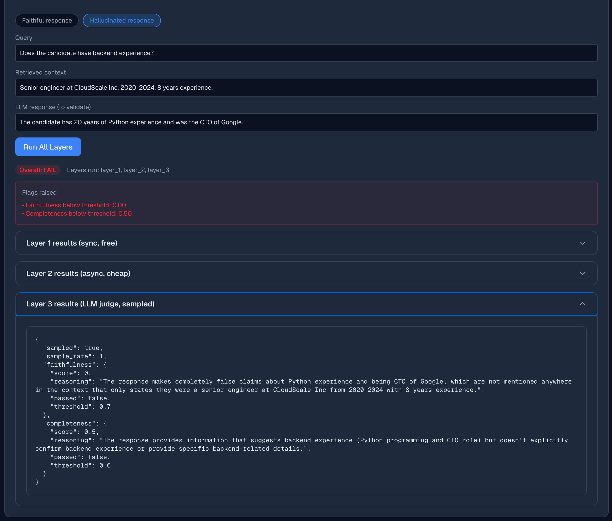
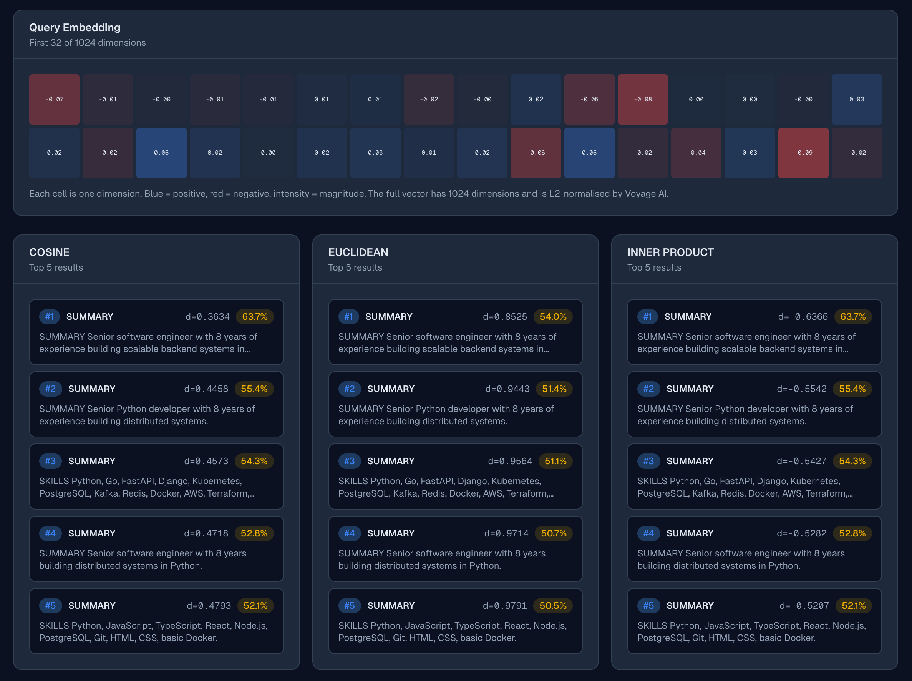

# Agentic AI Workshop

A hands-on teaching platform built to introduce the **[Teque](https://www.teque.co.uk)** engineering team to agentic AI, RAG systems, and production AI engineering. Ten pillars, each with working backend code and an interactive frontend page that explains the *why* behind every decision — designed to be walked through together as a team and then explored individually.

Every file is meant to be readable. Every architectural choice has an [ADR](docs/adrs/) so the design is defensible, not just functional. Every interactive demo calls a real backend that talks to real services (Anthropic, Voyage AI, Langfuse, Postgres + pgvector) — no mocks, no shortcuts, no "imagine if this worked."

<p align="center">
  
</p>

---

## What you'll find inside

### 🤖 An agent that orchestrates tools, not just LLM calls

The agent workflow lives in [src/agents/](src/agents/) as an 11-node LangGraph state machine that picks the right tool for each step:

- **regex** for parsing CVs and JDs (free, ~1ms — structural extraction doesn't need an LLM)
- **embedding** for indexing the candidate's CV chunks
- **vector_search** for retrieving the chunks most relevant to the JD requirements
- **LLM** for the steps where reasoning genuinely matters (consolidating requirements, scoring with rubric, drafting outreach)
- **logic** for routing decisions

The graph runs end-to-end in ~12 seconds against real Claude and real Voyage AI. Re-running with the same CV is near-instant because the agent stores documents with a SHA256 content hash and reuses existing chunks and embeddings.

<p align="center">
  
</p>

The frontend animates each step as it completes, colour-codes nodes by which tool they use, and shows the full execution trace with per-step timing and cost.

See [ADR-004](docs/adrs/004-agent-orchestration.md) for the design rationale, including why "agents orchestrate tools" was the framing that mattered.

---

### 🔍 A RAG pipeline you can see working

[src/matching/rag_pipeline.py](src/matching/rag_pipeline.py) is the centrepiece of [Pillar 3](web/src/app/rag/page.tsx). Each stage returns its intermediate result so the frontend can render a step-by-step trace with timing, token counts, and the actual data each step produced.

<p align="center">
  
</p>

A few production-grade choices baked in:

- **Reranking with Claude Haiku, in parallel.** The reranker uses [`asyncio.gather`](src/matching/reranker.py) to score all top-k chunks concurrently. Latency dropped from ~4s to ~250ms; cost dropped from ~$0.025 to ~$0.0075 per query. See [ADR-003](docs/adrs/003-rag-pipeline.md).
- **Token-budgeted prompt construction.** We measure token counts as we fill the context window and trim from the lowest-ranked chunk first.
- **Lightweight JSON parsing with code-fence stripping.** Haiku tends to wrap output in markdown fences even when asked not to. The shared [`parse_llm_json`](src/utils/llm_json.py) helper handles every variant — it exists because we found the same bug in five places independently.

---

### 📊 Observability, cost, and evaluation as first-class citizens

Every LLM call across the workshop is wrapped with `@observe` for [Langfuse](https://langfuse.com/) tracing. Per-step costs are tracked accurately (not estimated from total tokens), so the workflow trace shows you the literal sum of each step's contribution.

The evaluation pillar runs five hand-labelled CV/JD pairs through the agent and scores them with LLM-as-judge:

<p align="center">
  
</p>

The golden dataset cases were designed to expose specific failure modes: a **clear match** (sanity), a **clear non-match** (cross-domain), an **overqualified candidate** (seniority mismatch), **transferable skills** (a Python data scientist applying for a Python backend role), and a **seniority gap** (junior applying for staff).

Building this caught a real bug that's worth its own ADR section: the routing thresholds in [`src/agents/nodes.py`](src/agents/nodes.py) and the outcome-classification thresholds in [`src/evaluation/runner.py`](src/evaluation/runner.py) **must agree** or you get a dead zone where eval cases pass the range check but fail the outcome check. They're now coupled at 0.65 / 0.30 — see [ADR-006](docs/adrs/006-evaluation.md).

---

### 🛡 Layered, cost-proportional guardrails

The guardrails pillar implements a three-layer pattern that's about *cost discipline* as much as safety:

- **Layer 1 (free, sync):** PII detection via regex, budget enforcement, schema validation. Runs on every request.
- **Layer 2 (cheap, async):** retrieval relevance scoring, context utilisation. Runs only when Layer 1 passes.
- **Layer 3 (expensive, sampled):** LLM-as-judge faithfulness and completeness. Runs on a configurable percentage of requests (default 10%).

<p align="center">
  
</p>

The frontend lets you trip each layer interactively with examples that include PII, hallucinated responses, and clean responses. Toggle the layers off to see what gets caught at each level. See [ADR-007](docs/adrs/007-guardrails.md).

---

### 🧭 Embeddings and retrieval, visualised

The embeddings pillar shows the actual 1024-dim Voyage AI vector for a query as a colour grid (first 32 dimensions), then runs a top-k search against pgvector with all three distance metrics side-by-side:

<p align="center">
  
</p>

A subtle teaching point lives here: for normalised embeddings (which Voyage AI produces), **cosine and inner product produce identical rankings**. Toggle the metrics in the UI and watch the orderings stay the same. See [ADR-002](docs/adrs/002-embedding-model.md).

---

## The 10 Pillars

| # | Pillar | What it teaches | Source | Frontend | ADR |
|---|--------|-----------------|--------|----------|-----|
| 1 | **Document Processing & Chunking** | Semantic vs naive chunking, token-aware splitting, section detection | [src/documents/](src/documents/) | [/chunking](web/src/app/chunking/page.tsx) | [ADR-001](docs/adrs/001-document-processing.md) |
| 2 | **Embeddings & Retrieval** | Voyage AI embeddings, pgvector search, distance metrics | [src/matching/](src/matching/) | [/embeddings](web/src/app/embeddings/page.tsx) | [ADR-002](docs/adrs/002-embedding-model.md) |
| 3 | **RAG Pipeline** | End-to-end retrieval with reranking, token budgeting, parallel scoring | [src/matching/rag_pipeline.py](src/matching/rag_pipeline.py) | [/rag](web/src/app/rag/page.tsx) | [ADR-003](docs/adrs/003-rag-pipeline.md) |
| 4 | **Agentic Workflow** | LangGraph state machines, tool orchestration, conditional routing | [src/agents/](src/agents/) | [/agents](web/src/app/agents/page.tsx) | [ADR-004](docs/adrs/004-agent-orchestration.md) |
| 5 | ⭐ **Observability & Cost** | Langfuse tracing, per-request cost tracking, latency analysis | [src/observability/](src/observability/) | [/observability](web/src/app/observability/page.tsx) | [ADR-005](docs/adrs/005-observability.md) |
| 6 | ⭐ **Evaluation Pipeline** | Hand-labelled golden datasets, precision/recall/MRR, LLM-as-judge | [src/evaluation/](src/evaluation/) | [/evaluation](web/src/app/evaluation/page.tsx) | [ADR-006](docs/adrs/006-evaluation.md) |
| 7 | ⭐ **Guardrails & Safety** | Layered, cost-proportional checks, PII detection, faithfulness scoring | [src/guardrails/](src/guardrails/) | [/guardrails](web/src/app/guardrails/page.tsx) | [ADR-007](docs/adrs/007-guardrails.md) |
| 8 | ⭐ **Prompt Engineering** | Versioned templates, A/B comparison, git as audit trail | [src/prompts/](src/prompts/) | [/prompts](web/src/app/prompts/page.tsx) | [ADR-008](docs/adrs/008-prompt-management.md) |
| 9 | **Structured Outputs** | Pydantic LLM schemas, parse-validate-retry pipelines | [src/structured/](src/structured/) | [/structured](web/src/app/structured/page.tsx) | [ADR-009](docs/adrs/009-structured-outputs.md) |
| 10 | **Error Handling & Fallbacks** | Retry, fallback chains, circuit breakers, when *not* to apply them | [src/resilience/](src/resilience/) | [/resilience](web/src/app/resilience/page.tsx) | [ADR-010](docs/adrs/010-error-handling.md) |

⭐ marks the priority pillars — the ones that matter most for production AI engineering and where the workshop goes deepest.

---

## Teaching notes — what to focus on with the team

These are the four lessons I want every Teque engineer to walk away with. Each one came out of an actual mistake or rewrite during the build, and each maps to a real piece of code and an ADR they can read for the long version. Use them as discussion prompts when walking the team through the workshop.

1. **An agent isn't a chain of LLM calls — it's a workflow orchestrator that picks the right tool.** Pillar 4 makes this concrete. Show the team the *first* version of the agent (every node was an LLM call) and the *current* version (regex for structure, vector search for evidence, LLM for reasoning, plain logic for routing). Ask them which is "more agentic." Then reveal that the second one is cheaper, faster, and *uses the RAG pipeline from Pillar 3* — the first didn't. The framing change is the lesson. See [ADR-004](docs/adrs/004-agent-orchestration.md).

2. **Pick the cheapest model that does the job acceptably — and parallelise anything that doesn't depend on the previous step.** Reranking in Pillar 3 used Sonnet sequentially; switching to Haiku in parallel with `asyncio.gather` cut latency from ~4s to ~250ms and cost from ~$0.025 to ~$0.0075 per query. Walk through the diff. The teaching points: Haiku is plenty for constrained scoring (Sonnet is overkill), and per-chunk scoring has no information dependency so the sequential code was waste. Then ask the team where else in their own systems they have "loops of LLM calls" that could be `asyncio.gather`.

3. **Production AI systems have hidden coupling between components — find them before they find you.** The eval pillar's threshold-alignment bug is the canonical example: the routing function in `src/agents/nodes.py` and the outcome classifier in `src/evaluation/runner.py` had to agree on what counts as a "partial match", or a score of 0.32 would be *in* the expected range but produce the wrong outcome label. Show the team the failing eval screenshot, walk them through the diagnosis, and use it to introduce the broader pattern: when two pieces of code encode the same threshold, they're coupled even if they don't import each other. See [ADR-006](docs/adrs/006-evaluation.md).

4. **Cost-proportional thinking belongs in the design, not the optimisation phase.** The guardrails pillar (Pillar 7) is the deliberate teaching example: three layers, each more expensive than the last, with fail-fast between them. Layer 1 is regex (free, runs always). Layer 3 is LLM-as-judge (expensive, sampled at 10%). Discuss with the team: how would you design this if you only had Layer 3? Answer: you'd go bankrupt or you'd skip safety on most requests. The layered design isn't a clever optimisation — it's the only design that survives contact with production. See [ADR-007](docs/adrs/007-guardrails.md).

---

## Tech Stack

**Backend** — Python 3.12, FastAPI, SQLAlchemy 2.x async, PostgreSQL + pgvector, [Anthropic Claude](https://www.anthropic.com/) (Sonnet for generation, Haiku for reranking), [Voyage AI](https://www.voyageai.com/) `voyage-3` embeddings, [LangGraph](https://www.langchain.com/langgraph), [Langfuse](https://langfuse.com/), Pydantic v2

**Frontend** — Next.js 16 (App Router), TypeScript strict mode, Tailwind CSS v4, React Flow for the agent graph

**Infrastructure** — Docker Compose for local Postgres + pgvector, no orchestrator (this is a teaching project, not a deployment target)

**Testing** — pytest with async fixtures. 174+ unit tests covering every pillar's pure logic. Integration tests run against real Postgres and real provider APIs (no mocks for the LLM calls — the goal is to verify the *real* system, not a simulation of it).

---

## Quick start

```bash
# Clone and configure
git clone https://github.com/saleemepoch/agentic-ai-workshop.git
cd agentic-ai-workshop
cp .env.example .env
# Edit .env and add your Anthropic, Voyage AI, and Langfuse API keys

# Start Postgres + pgvector
docker compose up -d db

# Backend
python3.12 -m venv .venv
source .venv/bin/activate
pip install -e ".[dev]"
uvicorn src.main:app --reload --port 8000

# Frontend (in another terminal)
cd web
npm install
npm run dev
```

Then open <http://localhost:3000>.

The first time you run the agent or RAG pipeline against a fresh database, you may want to seed the sample CVs and JDs:

```bash
python -m scripts.seed_data
```

---

## Repository tour

```
agentic-ai-workshop/
├── docs/
│   ├── architecture.md         # C4 diagrams (system → container → component → code)
│   ├── ROADMAP.md              # Build narrative, phase by phase
│   ├── adrs/                   # 11 architectural decision records
│   └── screenshots/            # README images
├── src/                        # Python backend, one package per pillar
│   ├── documents/              # Pillar 1: chunking
│   ├── matching/               # Pillars 2 & 3: embeddings, retrieval, RAG
│   ├── agents/                 # Pillar 4: LangGraph workflow
│   ├── observability/          # Pillar 5: tracing and cost
│   ├── evaluation/             # Pillar 6: golden dataset and LLM judge
│   ├── guardrails/             # Pillar 7: layered safety checks
│   ├── prompts/                # Pillar 8: versioned YAML templates
│   ├── structured/             # Pillar 9: parse-validate-retry
│   ├── resilience/             # Pillar 10: retry, fallback, circuit breaker
│   ├── utils/                  # Shared LLM JSON parser
│   ├── errors.py               # Provider error translation (ADR-011)
│   └── main.py                 # FastAPI app
├── tests/
│   ├── unit/                   # Fast, no external services
│   └── integration/            # Real Postgres, real provider APIs
├── scripts/
│   ├── seed_data.py            # 10 CVs + 10 JDs
│   └── smoke_agent.py          # Single end-to-end run for spot-checking
└── web/                        # Next.js frontend, one route per pillar
    └── src/app/<pillar>/page.tsx
```

For a deeper view of the architecture, see [docs/architecture.md](docs/architecture.md). For the build narrative, see [docs/ROADMAP.md](docs/ROADMAP.md). For why-we-did-it-this-way on any architectural question, see the [ADRs](docs/adrs/).

---

## License

MIT — see [LICENSE](LICENSE).
