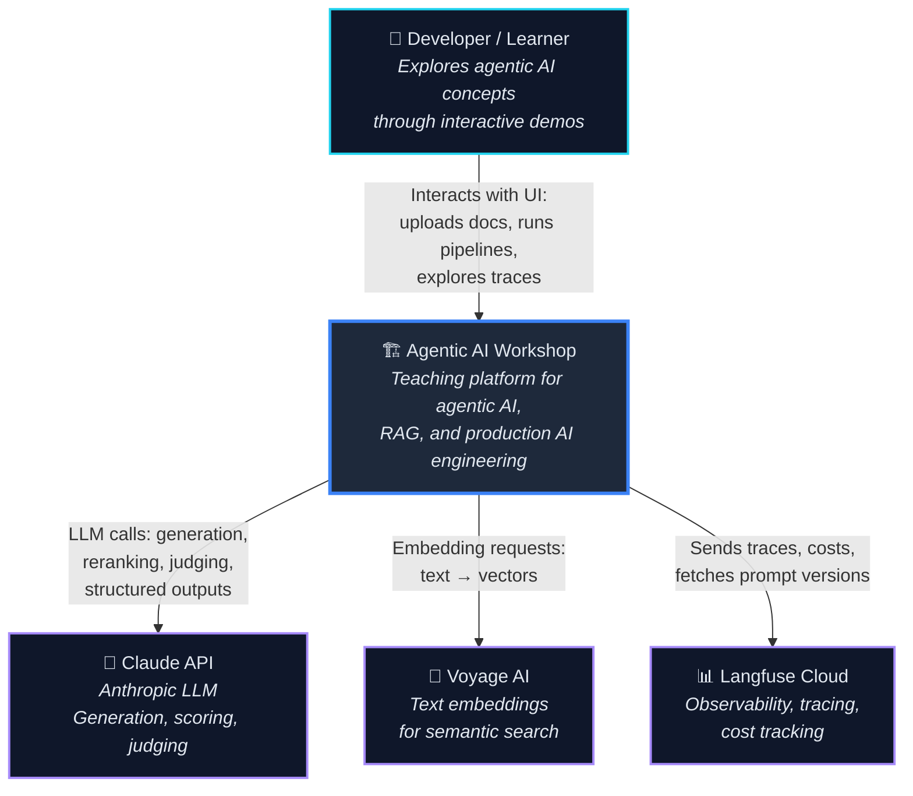
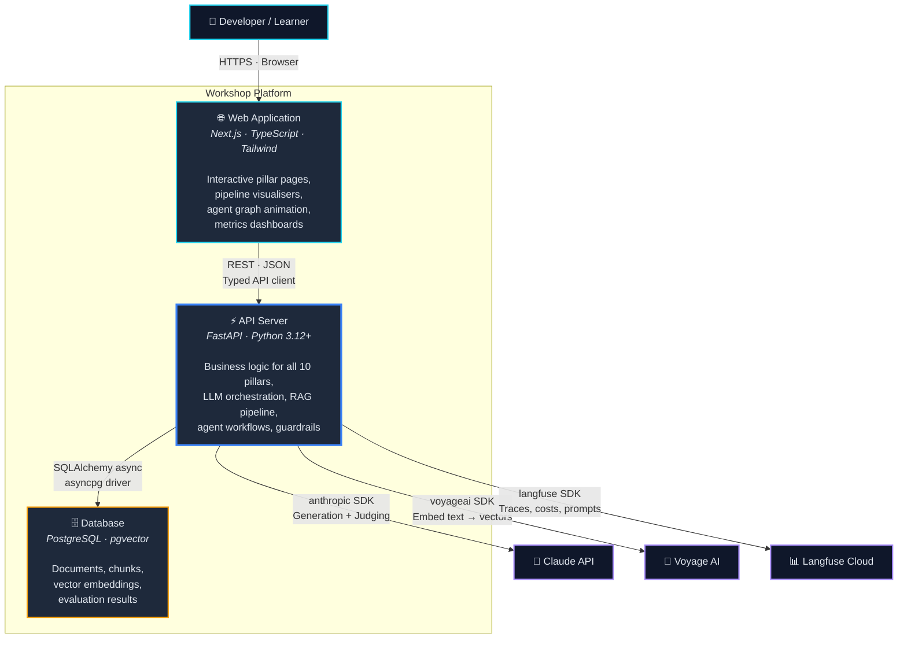
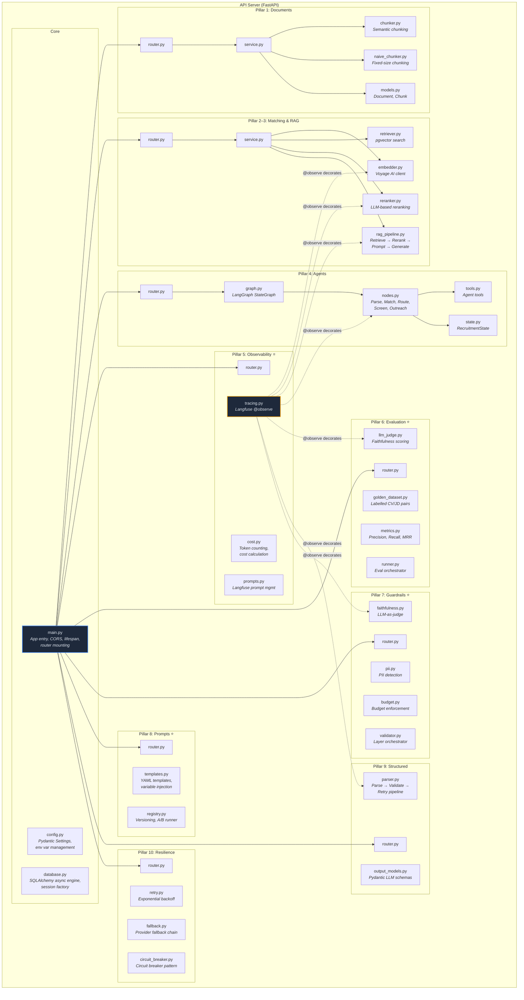
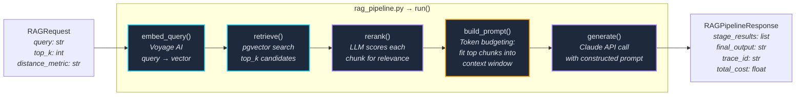
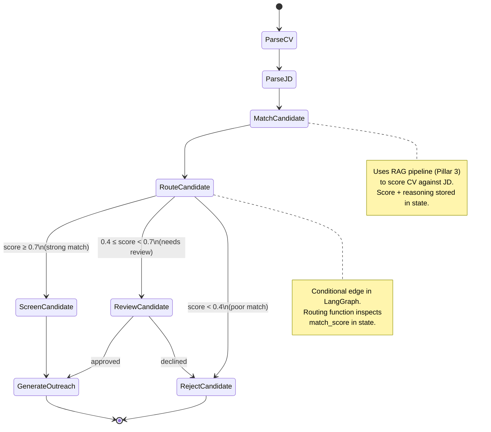
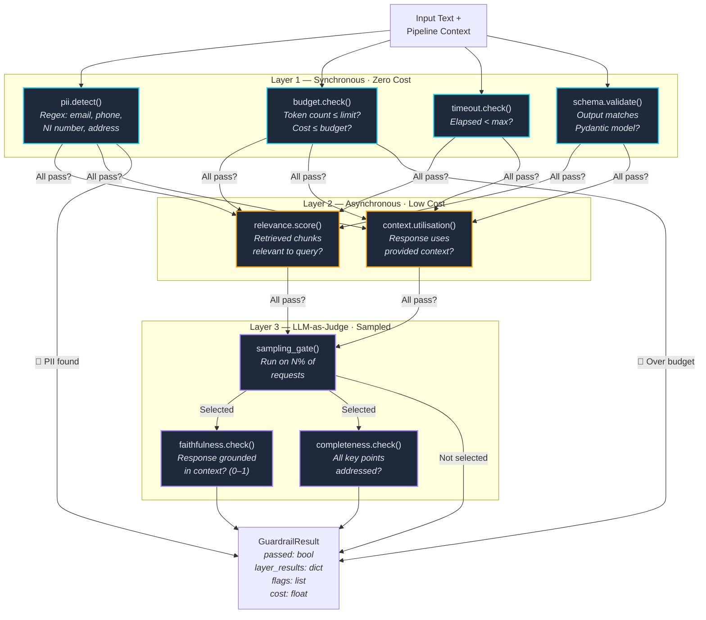

# Architecture — Agentic AI Workshop

> C4 model documentation. Four levels of zoom, from system context down to code.
> All diagrams use Mermaid. Each level includes explanatory text for teaching purposes.

---

## Level 1: System Context

**What this shows**: The workshop platform as a single box, the humans who use it, and the external services it depends on. This is the "elevator pitch" diagram — anyone should understand it in 30 seconds.

**Key decisions at this level**:
- Three external AI services, each with a distinct responsibility. No single vendor lock-in for all capabilities.
- Claude handles all generative tasks (matching, screening, outreach, judging). We chose a single LLM provider for consistency in the teaching narrative, though the fallback system (Pillar 10) demonstrates multi-provider resilience.
- Voyage AI is dedicated to embeddings — separated from the LLM provider because embedding-specialised models outperform general-purpose LLMs at vector representation (see ADR-002).
- Langfuse is the observability backbone — every LLM call is traced, costed, and auditable. This is non-negotiable for the production AI engineering story.

---

## Level 2: Container Diagram

**What this shows**: The major deployable units (containers) that make up the workshop platform, how they communicate, and what technology each uses. This is the diagram you'd draw on a whiteboard when onboarding a new team member.

**Key decisions at this level**:
- **Three containers, not a monolith**: Postgres, API, and Web are independently deployable via Docker Compose. This mirrors real-world architecture without over-engineering (no Kubernetes, no service mesh).
- **FastAPI as the API layer**: Async-native, automatic OpenAPI docs, Pydantic-first validation. The API is the single source of truth — the frontend never calls external services directly. See ADR-002.
- **PostgreSQL + pgvector**: One database for both relational data (documents, eval results) and vector search. Avoids the complexity of a separate vector database (Pinecone, Weaviate) while teaching the same concepts. See ADR-003.
- **Next.js App Router**: Server Components by default for fast initial loads, Client Components only where interactivity is needed (demos, animations). The frontend is interactive documentation, not a production SaaS.
- **Communication**: Web → API is REST/JSON via a typed TypeScript client. API → DB is SQLAlchemy async. API → external services use their respective Python SDKs.

---

## Level 3: Component Diagram

**What this shows**: The internal modules within the API server — each mapping to a pillar of the workshop. This is how a developer navigates the codebase.

**Key decisions at this level**:
- **Router → Service → Model**: Consistent layering. Routers handle HTTP concerns, services contain business logic, models handle persistence. No router ever touches the DB directly.
- **Tracing is cross-cutting**: The `@observe` decorator from `observability/tracing.py` wraps functions across all pillars. It's not isolated to Pillar 5 — it's woven through everything. Shown as dotted lines above.
- **Each pillar is a Python package**: Self-contained with its own router, service, schemas, and models. Pillars depend on each other where logical (Agents use Matching, Evaluation uses RAG) but avoid circular dependencies.
- **Guardrails orchestrator pattern**: `validator.py` orchestrates the three layers rather than each layer knowing about the others. This makes it easy to toggle layers, adjust sampling, and test in isolation.

---

## Level 4: Code Diagram

**What this shows**: Key classes, functions, and data flows within the most critical components. This level is selective — we zoom into the RAG pipeline, the agent graph, and the guardrails validator because these are the most architecturally interesting.

### 4a. RAG Pipeline — Internal Flow

**Teaching points**:
- Each stage is independently observable (own Langfuse span) and returns intermediate results for the frontend.
- `build_prompt()` is where token budgeting happens: we measure how many tokens the retrieved chunks consume and trim to fit the model's context window. This is a critical production concern most tutorials skip.
- `rerank()` is an LLM call itself — it adds latency and cost, but dramatically improves relevance. The evaluation pipeline (Pillar 6) quantifies this improvement.

### 4b. Agent Graph — State Machine

**Teaching points**:
- Every node reads from and writes to `RecruitmentState` — a TypedDict that flows through the graph. The state at each step is serialised for the frontend's step-through debugger.
- Conditional routing is the core agentic concept: the graph makes decisions based on intermediate results, not a hardcoded sequence.
- Each node is a plain Python function decorated with `@observe`. No magic — just functions, state, and edges.

### 4c. Guardrails Validator — Layered Execution

**Teaching points**:
- **Cost-proportional checking**: Layer 1 is free (regex, arithmetic), Layer 2 is cheap (embedding similarity), Layer 3 is expensive (LLM calls). We only spend more money when cheaper checks have passed.
- **Fail-fast**: If Layer 1 catches PII, we never run Layers 2 or 3. This is the same principle as short-circuit evaluation.
- **Sampling**: Layer 3 runs on a configurable percentage of requests (e.g., 10%). In production, you can't afford to LLM-judge every response — but you need enough coverage to catch systematic issues. The sampling rate is a tunable knob exposed in the API.

---

## Data Flow: End-to-End Request

**What this shows**: A single request flowing through the entire system — from user action to response. This ties all four C4 levels together.

```mermaid
sequenceDiagram
    participant U as User (Browser)
    participant W as Web (Next.js)
    participant A as API (FastAPI)
    participant DB as PostgreSQL
    participant V as Voyage AI
    participant C as Claude API
    participant L as Langfuse

    U->>W: Upload CV, select JD, click "Match"
    W->>A: POST /agents/run {cv_text, jd_text}

    Note over A,L: Trace started — all steps nested under parent span

    A->>L: Create trace (workflow start)

    rect rgb(30, 41, 59)
        Note over A: Node: parse_cv
        A->>C: Parse CV → structured output
        C-->>A: CandidateProfile (Pydantic)
        A->>L: Span: parse_cv (tokens, cost, latency)
    end

    rect rgb(30, 41, 59)
        Note over A: Node: parse_jd
        A->>C: Parse JD → structured output
        C-->>A: JobRequirements (Pydantic)
        A->>L: Span: parse_jd
    end

    rect rgb(30, 41, 59)
        Note over A: Node: match_candidate (RAG)
        A->>V: Embed JD requirements
        V-->>A: Query vector
        A->>DB: pgvector similarity search
        DB-->>A: Top-k CV chunks
        A->>C: Rerank chunks for relevance
        C-->>A: Reranked results
        A->>C: Generate match assessment
        C-->>A: MatchAssessment (score + reasoning)
        A->>L: Span: match_candidate (nested: embed, retrieve, rerank, generate)
    end

    rect rgb(30, 41, 59)
        Note over A: Node: route_candidate
        alt score ≥ 0.7
            Note over A: → screen_candidate → generate_outreach
            A->>C: Screen candidate
            A->>C: Draft outreach email
        else score < 0.4
            Note over A: → reject_candidate
        end
        A->>L: Span: route + downstream nodes
    end

    rect rgb(15, 23, 42)
        Note over A: Guardrails (post-processing)
        A->>A: Layer 1: PII check, budget check
        A->>A: Layer 2: relevance score
        opt Sampled (10%)
            A->>C: Layer 3: faithfulness judge
        end
        A->>L: Span: guardrails
    end

    A->>L: Close trace (total cost, total latency)
    A-->>W: WorkflowResponse {steps[], final_output, trace_id, cost}
    W-->>U: Render: graph animation, state inspector, results
```

**This diagram demonstrates**:
- Every external call is traced in Langfuse with token counts and costs
- The agent workflow (Pillar 4) internally uses the RAG pipeline (Pillar 3), which uses embeddings (Pillar 2) and documents (Pillar 1)
- Guardrails (Pillar 7) run as post-processing on the agent's output
- The frontend receives enough data to render the full step-through experience
- Structured outputs (Pillar 9) are used throughout — every LLM response is parsed into a Pydantic model
- Error handling (Pillar 10) wraps every external call (not shown for clarity, but retry/fallback/circuit-breaker surround each API call)
